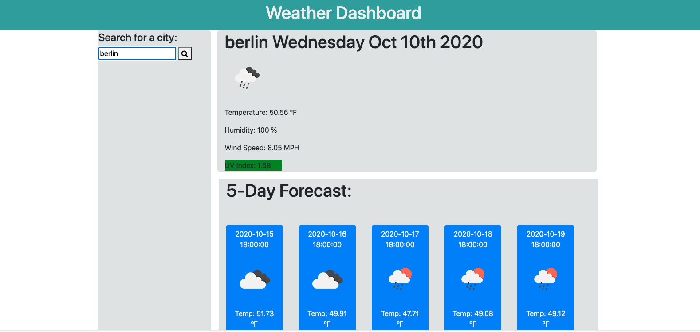

# weather-dashboard

In this project, I have built a functional weather dashboard app. It will run in the browser and feature dynamically updated HTML and CSS. Powering the functionality of this app is a third party API known as OpenWeather API. This API allows me to access their data and functionality by making requests with specific parameters to the URL.

## Installation of Repo

Follow these steps to view my project!

1. Open link in github. - https://github.com/xdanielmtz/weather-dashboard
2. Clone with SSH
3. Run "git clone" command in Terminal with the pasted link
4. Run "code ." command to open in VS Code.
5. Enjoy.

## What will you find in this repo?

- An index.html (The web application itself)
- CSS sheet 
- Javascript page
- A readme.

## Upon opening the application:

You will search a city and then will be presented with current and future conditions for that city.
WHEN you view the current weather conditions for that city
THEN you will be presented with the city name, the date, an icon representation of weather conditions, the temperature, the humidity,
the wind speed, and the UV index. 
WHEN you view the UV index, you will be presented with a color that indicates whether the conditions are favorable, moderate, or severe.
WHEN you view future weather conditions for that city, THEN  you will be presented with a 5-day forecast that displays the date, an icon representation of weather conditions, the temperature, and the humidity. 

## Deployed Site Link:
(Work Day Scheduler) https://xdanielmtz.github.io/weather-dashboard/

## Sneak Peak:
 

## Contact Me!
xdanielmtz@gmail.com

## The MIT License (MIT)

Copyright (c) 2015 Chris Kibble

Permission is hereby granted, free of charge, to any person obtaining a copy of this software and associated documentation files (the "Software"), to deal in the Software without restriction, including without limitation the rights to use, copy, modify, merge, publish, distribute, sublicense, and/or sell copies of the Software, and to permit persons to whom the Software is furnished to do so, subject to the following conditions:

The above copyright notice and this permission notice shall be included in all copies or substantial portions of the Software.

THE SOFTWARE IS PROVIDED "AS IS", WITHOUT WARRANTY OF ANY KIND, EXPRESS OR IMPLIED, INCLUDING BUT NOT LIMITED TO THE WARRANTIES OF MERCHANTABILITY, FITNESS FOR A PARTICULAR PURPOSE AND NONINFRINGEMENT. IN NO EVENT SHALL THE AUTHORS OR COPYRIGHT HOLDERS BE LIABLE FOR ANY CLAIM, DAMAGES OR OTHER LIABILITY, WHETHER IN AN ACTION OF CONTRACT, TORT OR OTHERWISE, ARISING FROM, OUT OF OR IN CONNECTION WITH THE SOFTWARE OR THE USE OR OTHER DEALINGS IN THE SOFTWARE.